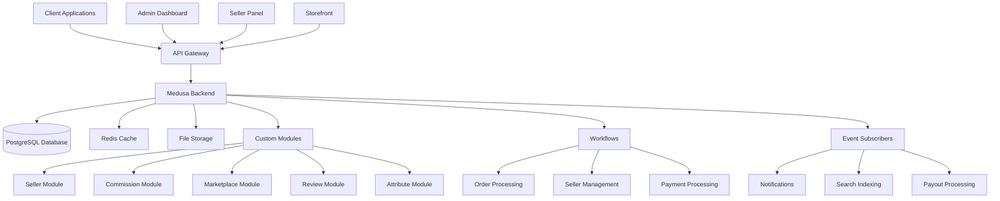
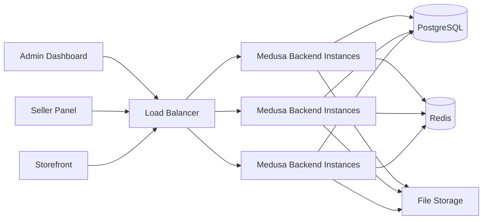

# Mercur Marketplace Platform Architecture

## Overview

Mercur is an open-source marketplace platform built on top of MedusaJS, designed to create custom marketplaces for various business models including B2B and B2C. It provides a complete solution with vendor systems, admin panels, and storefronts.

## System Architecture

### High-Level Architecture

### Core Components

#### 1. Medusa Framework
- **Base**: Built on MedusaJS v2 framework
- **Modules**: Uses Medusa's modular architecture with custom extensions
- **Services**: Leverages Medusa's core services (Product, Order, Customer, etc.)

#### 2. Custom Modules
The platform extends Medusa with several custom modules:

##### Seller Module (`@mercurjs/seller`)
- Manages marketplace vendors/sellers
- Handles seller onboarding and member management
- Tracks seller status and store information

##### Marketplace Module (`@mercurjs/marketplace`)
- Manages order sets (collections of orders from multiple sellers)
- Handles marketplace-specific business logic

##### Commission Module (`@mercurjs/commission`)
- Calculates and manages commissions for sellers
- Configurable commission rules and rates
- Supports percentage and flat-rate commissions

##### Review Module (`@mercurjs/reviews`)
- Manages product and seller reviews
- Handles customer feedback system

##### Attribute Module (`@mercurjs/attribute`)
- Manages product attributes and attribute values
- Provides flexible product customization options

##### Additional Modules
- Brand Module: Product brand management
- Payout Module: Seller payment processing
- Request Module: Handles various marketplace requests
- Wishlist Module: Customer wishlist functionality

#### 3. API Layer

##### Admin API
- Manages marketplace administration
- Seller management endpoints
- Commission configuration
- Order and product management
- Request handling (product requests, seller requests, etc.)

##### Store API
- Customer-facing endpoints
- Product browsing and search
- Cart and checkout functionality
- Order management
- Review submission

##### Vendor API
- Seller-specific endpoints
- Product management for sellers
- Order management for sellers
- Commission tracking

#### 4. Workflows

The platform uses Medusa's workflow system for complex business processes:

##### Order Processing Workflow
- Splits cart into seller-specific orders
- Handles payment authorization and capture
- Manages inventory reservation
- Creates order sets for marketplace management

##### Seller Management Workflow
- Handles seller creation and onboarding
- Manages seller member invitations
- Updates seller information

##### Commission Calculation Workflow
- Calculates commissions for each order line item
- Applies commission rules based on seller, product type, and category
- Creates commission lines for tracking

##### Payout Processing Workflow
- Processes seller payouts based on completed orders
- Integrates with Stripe for payment processing

#### 5. Event System

##### Subscribers
- Order processing events
- Payment capture events
- Payout processing events
- Notification events
- Search indexing events

##### Events
- Order placed events
- Payment captured events
- Seller status change events
- Product update events
- Review creation events

#### 6. Data Models

##### Core Entities
- **Seller**: Marketplace vendor with store information
- **OrderSet**: Collection of orders from multiple sellers
- **CommissionRule**: Rules for calculating seller commissions
- **CommissionRate**: Specific commission rates and calculations
- **Review**: Product and seller reviews from customers
- **Attribute**: Product attributes for customization

##### Relationships
- Sellers have many products (via links)
- Sellers have many orders (via links)
- OrderSets contain multiple orders
- Products have attributes and attribute values
- Orders generate commission lines based on rules

#### 7. Integrations

##### Payment Processing
- Stripe integration for payments
- Stripe Connect for marketplace payments
- Split payment handling for multiple sellers

##### Search
- Algolia integration for product search
- Real-time indexing of products and sellers

##### Communication
- Resend integration for email notifications
- TalkJS integration for messaging between buyers and sellers

##### Notifications
- Email notifications via Resend
- In-app notifications via local provider
- Seller-specific notification system

## Technical Stack

### Backend
- **Framework**: MedusaJS v2
- **Language**: TypeScript
- **Database**: PostgreSQL
- **Cache**: Redis
- **API**: RESTful API with OpenAPI specification
- **Authentication**: JWT-based authentication
- **File Storage**: Configurable (local, S3, etc.)

### Frontend
- **Admin Panel**: React-based dashboard
- **Storefront**: Configurable storefront (B2C reference implementation available)
- **Vendor Panel**: Seller management interface

### Infrastructure
- **Deployment**: Self-hosted or cloud deployment
- **Containerization**: Docker support
- **Orchestration**: Kubernetes-ready

## Deployment Architecture

## Security

- JWT-based authentication
- Role-based access control (admin, seller, customer)
- Secure payment processing with Stripe
- Environment-based configuration management
- CORS configuration for different client applications

## Scalability

- Horizontal scaling of backend instances
- Database connection pooling
- Redis caching for frequently accessed data
- Asynchronous processing with workflows and events
- Microservices architecture with module isolation

## Extensibility

- Custom module development
- Workflow customization
- Event subscriber extensions
- API route customization
- Admin panel customization