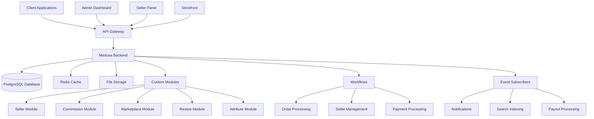
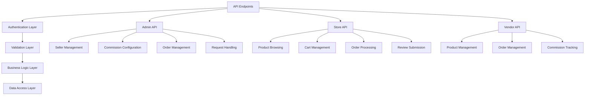
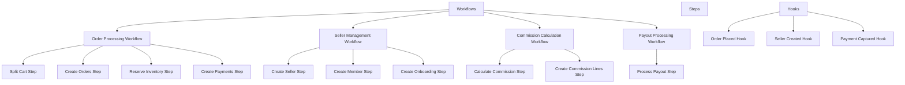
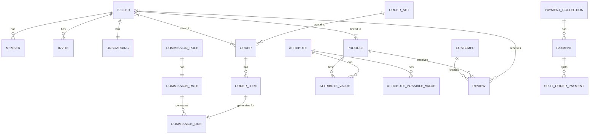
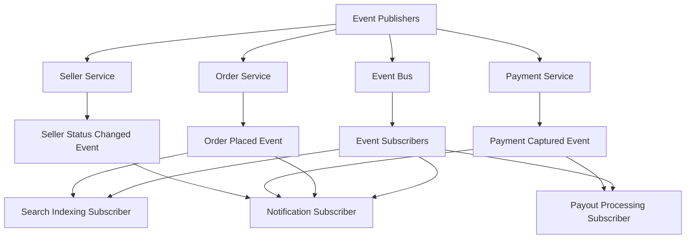
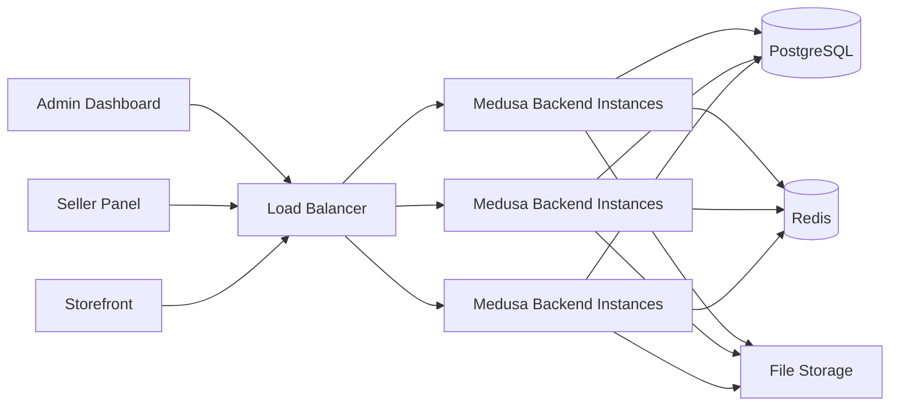

# Mercur System Architecture Diagrams

## 1. High-Level System Architecture



## 2. Module Architecture

```mermaid
graph TD
    A[Medusa Core Modules]
    B[Custom Mercur Modules]
    
    A --> C[Product Module]
    A --> D[Order Module]
    A --> E[Customer Module]
    A --> F[Payment Module]
    A --> G[Inventory Module]
    
    B --> H[Seller Module]
    B --> I[Marketplace Module]
    B --> J[Commission Module]
    B --> K[Review Module]
    B --> L[Attribute Module]
    B --> M[Brand Module]
    B --> N[Payout Module]
    B --> O[Request Module]
    B --> P[Wishlist Module]
    
    H --> Q[Seller Entity]
    H --> R[Member Entity]
    H --> S[Invite Entity]
    H --> T[Onboarding Entity]
    
    I --> U[OrderSet Entity]
    
    J --> V[CommissionRule Entity]
    J --> W[CommissionRate Entity]
    J --> X[CommissionLine Entity]
    
    K --> Y[Review Entity]
    
    L --> Z[Attribute Entity]
    L --> AA[AttributeValue Entity]
    L --> AB[AttributePossibleValue Entity]
```



## 3. API Layer Architecture



## 4. Workflow Architecture



## 5. Data Model Relationships



## 6. Event System Architecture



## 7. Deployment Architecture



## 8. Payment Flow Architecture

```mermaid
graph TD
    A[Customer] --> B[Storefront]
    B --> C[Cart Creation]
    C --> D[Checkout Process]
    D --> E[Payment Authorization]
    E --> F[Order Splitting]
    F --> G[Order Creation]
    G --> H[Inventory Reservation]
    H --> I[Payment Capture]
    I --> J[Commission Calculation]
    J --> K[Payout Processing]
    
    L[Stripe] --> E
    L --> I
    
    M[Seller 1]
    N[Seller 2]
    O[Seller N]
    
    F --> M
    F --> N
    F --> O
    
    K --> M
    K --> N
    K --> O